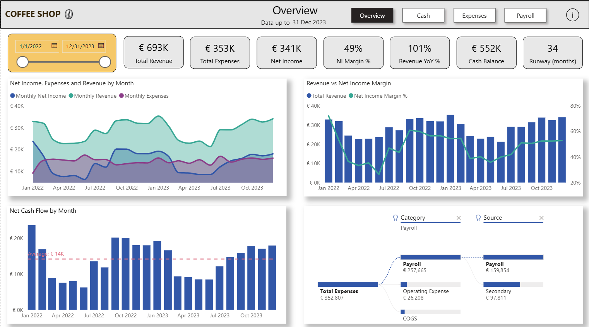
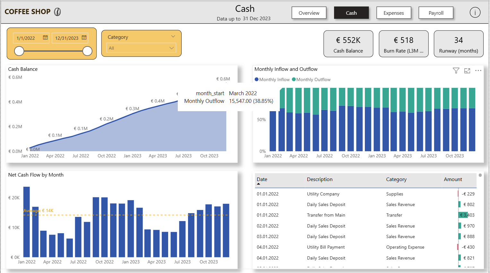
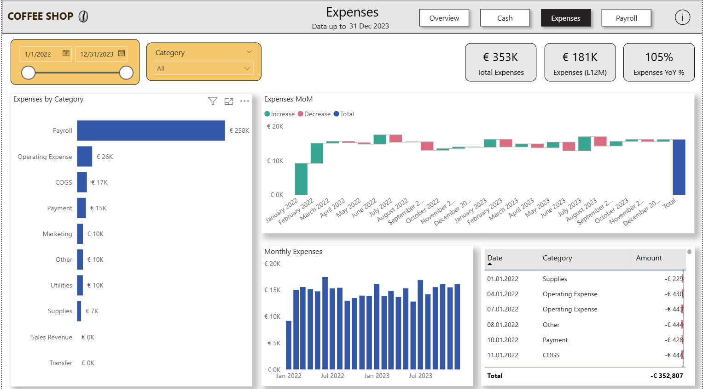
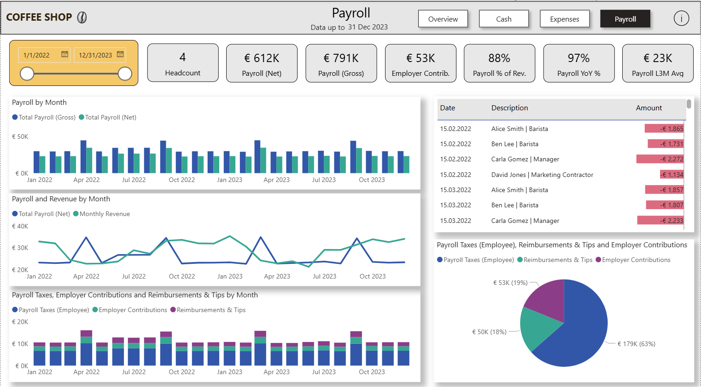

# Financial Performance Dashboard (PostgreSQL + Power BI)

**What:** P&L, cash flow, payroll, and cash runway for an SME using bank/credit-card/payroll data.  
**Stack:** PostgreSQL (staging → analytics views) + Power BI (model, DAX, visuals).

  

  

  

  

---

## Repo structure

~~~text
.
├─ sql/                       # All database objects
│  └─ financial_performance_dashboard.sql
├─ powerbi/                   # Power BI report (PBIX)
│  └─ dashboard.pbix
├─ docs/                      # Screenshots / PDFs (optional)
├─ data/                      # Local CSVs (ignored by git)
├─ LICENSE
└─ README.md
~~~

---

## Quick start

### 1) Build the database
1. Create a PostgreSQL database.
2. Run `sql/financial_performance_dashboard.sql`.
3. Import your CSVs into the **staging** tables (`*_raw`) using pgAdmin (CSV, HEADER).  
   _If you re-import, re-run the “RAW → ANALYTICS” section or the whole script._
4. Sanity check:

~~~sql
SELECT COUNT(*) FROM analytics.v_fact_cash_txn;
SELECT * FROM analytics.v_monthly_pnl LIMIT 5;
~~~

### 2) Power BI setup
1. Open `powerbi/dashboard.pbix` (or create a new PBIX and import the objects below).
2. **Import (Import mode):**  
   `analytics.dim_calendar`, `analytics.v_fact_cash_txn`,  
   `analytics.v_monthly_pnl`, `analytics.v_monthly_cashflow`,  
   `analytics.v_monthly_payroll`, `analytics.v_daily_cash_balance`,  
   `analytics.v_expense_by_category_month`
3. **Mark Date table:** `analytics dim_calendar` (column: `date`).
4. **Create month helper** in Power BI:

~~~DAX
DimMonth = DISTINCT ( 'analytics dim_calendar'[month_start] )
~~~

5. **Relationships** (Single direction, **1 → \***):
   - `analytics dim_calendar[date]` → `v_fact_cash_txn[txn_date]`
   - `analytics dim_calendar[date]` → `v_daily_cash_balance[date]`
   - `DimMonth[month_start]` → `v_monthly_pnl[month]`
   - `DimMonth[month_start]` → `v_monthly_cashflow[month]`
   - `DimMonth[month_start]` → `v_monthly_payroll[month]`
   - `DimMonth[month_start]` → `v_expense_by_category_month[month]`
6. **Bridge Date ↔ Month (so one date slicer filters everything):**  
   Create relationship `analytics dim_calendar[month_start]` ↔ `DimMonth[month_start]`, set **Cross filter = Both**.
7. Refresh the model.

> Signs are normalized in SQL: **inflow = +**, **outflow = −** (see `v_fact_cash_txn`). If a number looks wrong, adjust that view once—DAX follows.

---

## What’s in the SQL

- **Schemas**
  - `staging` – raw TEXT tables for CSV import  
  - `analytics` – typed tables + BI views
- **Key objects**
  - `analytics.dim_calendar` – daily calendar + `month_start`
  - `analytics.v_fact_cash_txn` – unified transactions (bank, CC, payroll) with normalized signs
  - `analytics.v_monthly_pnl` – Revenue, Expenses, Net Income (by month)
  - `analytics.v_monthly_cashflow` – Net cash flow (by month)
  - `analytics.v_monthly_payroll` – Gross/Net, taxes, contributions, reimbursements
  - `analytics.v_daily_cash_balance` – bank-only running cash balance
  - `analytics.v_expense_by_category_month` – expenses by category (by month)

---

## Measures used (minimal set)

- **Transactions (daily):** `Total Revenue`, `Total Expenses`, `Net Income`, `Net Income Margin %`,  
  `Revenue YoY %`, `Monthly Burn (MTD)`, `Cash Balance`, `Runway (months)`
- **Monthly (views):** `Monthly Revenue`, `Monthly Expenses`, `Monthly Net Income`,  
  `Net Cash Flow (Monthly)`, `Category Expenses`
- **Payroll:** `Total Payroll (Net)`, `Total Payroll (Gross)`, `Employer Contributions`, `Payroll % of Revenue`, `Payroll YoY %`
- **People:** `Employees` (distinct count)

---

## Report pages

- **Overview** — KPI cards (Revenue, Expenses, Net, Margin, YoY, Cash, Runway) + monthly trends.  
- **Cash** — daily cash balance, monthly net cash flow, inflow/outflow split, top outflows table.  
- **Expenses** — monthly expenses, top categories, MoM waterfall, detailed transactions.  
- **Payroll** — gross vs net, taxes/contrib/reimbursements, % of revenue, headcount.

_All pages respect the main Date slicer via the Date↔Month bridge._

---

## Data model

~~~text
DIMENSIONS
- analytics dim_calendar (date, month_start)
- DimMonth (month_start)

FACTS / VIEWS
- v_fact_cash_txn (txn_date, amount, category, source)
- v_daily_cash_balance (date, cash_balance)
- v_monthly_pnl (month, revenue, expenses, net_income)
- v_monthly_cashflow (month, net_cash_flow)
- v_monthly_payroll (month, net_pay, ...)
- v_expense_by_category_month (month, category, expenses)

RELATIONSHIPS (Single direction unless noted)
- analytics dim_calendar[date] (1) -> v_fact_cash_txn[txn_date] (*)
- analytics dim_calendar[date] (1) -> v_daily_cash_balance[date] (*)
- DimMonth[month_start] (1) -> v_monthly_pnl[month] (*)
- DimMonth[month_start] (1) -> v_monthly_cashflow[month] (*)
- DimMonth[month_start] (1) -> v_monthly_payroll[month] (*)
- DimMonth[month_start] (1) -> v_expense_by_category_month[month] (*)

BRIDGE (to let one Date slicer filter monthly views)
- analytics dim_calendar[month_start] <-> DimMonth[month_start]  (Cross filter = Both)
~~~

---

## Refresh & sharing

- **Gateway:** Configure On-premises Data Gateway for PostgreSQL in the Power BI Service.  
- **Scheduled refresh:** Enable on the dataset after publishing.  
- **Sharing:** Internal or B2B guest access (secure). For public demos, _Publish to web_ (non-sensitive only).

---

## Troubleshooting

- **Expenses show 0** → fix signs in `v_fact_cash_txn`, refresh.  
- **Daily cash only rises** → ensure `v_daily_cash_balance` uses **bank sources only** (as scripted).  
- **Date slicer doesn’t filter monthly charts** → verify the Date↔Month relationship is **Both**; otherwise use `TREATAS` in monthly measures.  
- **PBIX > 100 MB** → upload under **Releases** or use **Git LFS**; regular web upload will fail.

---

## License

MIT (see `LICENSE`).

**Author:** Hampus Willfors — Lightweight, reproducible finance analytics for SMEs.
